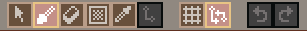
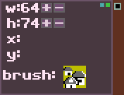
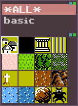
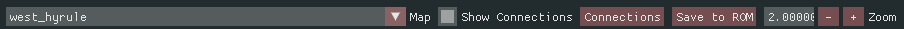
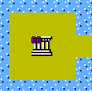
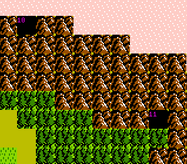
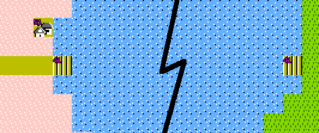

# Overworld Editor

The overworld editor is based on the
[`stb_tilemap_editor`](https://github.com/nothings/stb) library.

## Usage

### Keyboard keys:

* Arrow keys: scroll the map area.
* `S`: Select tool.
* `B`: Brush tool.
* `R`: Rectangular fill tool.
* `E`: Eyedropper.
* `L`: Link tool (unimplemented).
* `G`: Toggle grid.
* `CTRL+X`: Cut selected area.
* `CTRL+C`: Copy selected area.
* `CTRL+V`: Paste selection.
* `CTRL+Z`: Undo.
* `CTRL+Y`: Redo.

There is also a toolbar which corresponds to each of the keyboard actions:

### Edit State

Along the left side of the editing area is a box with editing state:

The box shows the current dimensions of the map, the cursor position within
the map and which tile is currently selected.  Zelda 2 overworld
maps **must** be 64 tiles wide and 75 tiles tall.

NOTE: unsure about the height requirement.

### Tile Palette

The tile palette allows you to choose which tile to paint onto the map.

### Top Level Tool Bar

The top-level tool bar allows you to perform several global actions to the map
editor.

* Select which map to edit.
* Show or Hide overworld connection IDs.
* Edit overworld connections.
* Save the edited map into the ROM.
* Change the zoom level.

### Overworld connections

There are may positions on overworld maps which transfer link to other locations
or to side-view areas.  These are shown on the map by a 2-digit number
over the tile which causes the transfer.

The *Connections* button in the top tool bar allows you to view and edit
the connection data.

The `Entry` field is which connection in the list of connections is being
displayed.

The `xpos` and `ypos` are coordinates on the overworld which activate this
connection.

The `map` and `world` are where the connection connects to.

There are several properties which control the behavior of a connection.

* `entry`: X pixel to enter the sideview area.  This is used to put link into
  the middle of an area, or on the right-hand side of an area.
* `extern`: this connection is external to this world.  This is used to transfer
  link between East and West Hyrule, Death Mountain or Maze Island.
* `second`: this is the second (or last) room of a multi-room transfer.
* `2 lower`: exit this two tiles lower than the entry.
* `right`: force entry on the right-hand side of the area.
* `passthru`: the area is a pass-through area.
* `fall`: Link falls down into the area.

#### Right-click context connection editor

If you right-click on the 2-digit number on the map, a context popup
window will allow you to edit the properties of the connection.

In the right-click context popup, changing the *Swap* field will swap the
transfer ID with the ID you select.  More precisely, the position,
connection and properties will be exhanged with the new ID, making the new
ID the transfer table entry for that location on the map.  Allowing the
exchange of IDs is necessary because of some of the in connection
table requirements.

The other items in the context window allow behave just as they do in the
normal connection editor window.

### Connection Requirements

#### Connector Caves

When a cave connects two areas together, the left entry of the cave (or set
of caves) must use the lower numbered ID.  For example, Parapa cave uses
IDs 10 and 11.

#### Overworld-to-Overworld connections

When connecting two overworlds together, the connection must use the same
ID in both maps.  For example, the raft connection between East and West
Hyrule uses ID 41.

Vanilla game connectors:

* ID 40 connects East Hyrule and the Maze via the bridge.
* ID 41 connects West and East Hyrule, via the raft.
* ID 42 connects West Hyrule and Death Mountain near Saria Town.
* ID 43 connects West Hyrule and Death Mountain near the graveyard.
