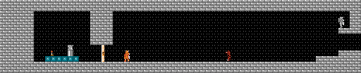
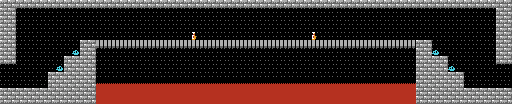

# Keeping track of collectable items

Zelda 2 tracks collectable items throughout the game with a bitmap which
represents every screen in the game.  The initial state of this bitmap
is stored in bank `5` at `$bb15`.

When a new save file is created, this bitmap is copied into the player's
battery backed RAM.  When a game is started, the player's copy is copied
to address `$600` in NES RAM.

It is a limitation of the game that each individual screen may have only
1 collectable item.  Recall that every "world" in Zelda2 can have 63
side-scroll areas, and each side-scroll area can be up to 4 screens wide.

Therefore, each "world" bitmap is 32 bytes long.

| ROM Bank | World | Description          | Base Address |
|---------:|------:|----------------------|-------------:|
| 1        | 0     | West Hyrule          | `$600` |
| 1 & 2    | 1     | Death Mt. / Maze Is. | `$620` |
| 2        | 2     | East Hyrule          | `$640` |
| 3        | 4     | Towns                | `$660` |
| 4        | 12, 12, 14 | Palaces 1, 2, 5 | `$680` |
| 4        | 16, 17, 18 | Palaces 3, 4, 6 | `$6a0` |
| 5        | 22    | Great Palace         | `$6c0` |

To calculate which bit represents which screen:

```
addr = lookup_base_address(bank, world) + (sidescroll_area / 2);
bit = 7 - (screen_num + 4 * (sidescroll_area & 1));
```

### Example

The candle is in Palace 1 room 8, directly next to a crumble bridge with a
50-point bag in room 9. Note that the map for room 9 actually puts two
P-bags on the bridge.

| Room 8 | Room 9 |
|--------|--------|
|  |  |

The data for these two rooms is in `$684` (calculated as `$680 + 8 / 2`).

The default (new-game) value for `$684` is `$fd`, which has a bit pattern of
`1111 1101`.  Because of the default value of the bitmap for room 9, only the
leftmost P-bag is present in room 9.
