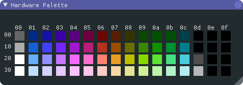

# The Zelda 2 ROM

The Zelda 2 ROM has lots of data which describes how to draw maps and display
game objects (backgrounds, items, enemies).

Like all NES ROMs there are two types of ROM bank: PRG bank and CHR banks.
PRG banks contain code and data availble to the CPU, while CHR banks contain
data used by the PPU.

In this document, unless explitly stated othewise, *bank* or *ROM bank* refers
to PRG banks.

The Zelda2 ROM contains 8 PRG banks and 14 CHR banks and uses Nintendo mapper
`MMC1` to manage the banks.  Each of the PRG banks is 16KiB (`$4000` bytes).

## PRG Bank Structures

Each bank which contains map data (both overworld and sideview) has a number
of structures describe that data.

### Map Pointers

At offset `$500` in each bank there is a table of pointers to the overworld
maps and object tables for sideview maps.  Since these banks are always mapped
in lower `MMC1` slot, the structure always shows up at `$8500`.

The layout of this data is

```
struct {
    uint16_t object_table[4];
    uint16_t overworld_map[2];
    ???
};
```

We can see a sample from bank 1:

```
address    00 01 02 03 04 05 06 07 08 09 0a 0b 0c 0d 0e 0f
--------   -----------------------------------------------
00008500:  17 84 17 84 9f 84 7d 93 5c 90 4c a6 48 29 c0 18
```

This tells us that the object tables (for drawing sideview maps)
are located at `$8417`, `$8417`, `$849f` and `$937d`.  The two overworld
maps in this bank are located at `$905c` and `$a64c`.

We can examine bank 3, which contains only the sideview maps for the
palaces:

```
address    00 01 02 03 04 05 06 07 08 09 0a 0b 0c 0d 0e 0f
--------   -----------------------------------------------
00008500:  a2 86 a2 86 ca 83 2e 84 ff ff ff ff 48 29 c0 18
```

We notice that the overworld map addresses are `$ffff`, which signifies there
are no overworld maps in bank 3.

### Sideview Map Pointers

The sideview maps are stored compressed in the ROM in two groups of 63.
There are two tables of pointers to the sideview data: One at `$8523` and
one at `$A000`.  In addition, some sideview maps have a background map
which is drawn behind the map data (e.g. forest backrounds and a couple of
items caves, like the Heart Container cave are this way).  The pointers
to these background maps are located at `$8000`.


### Palettes

Each bank contains palettes describing which NES colors to use when drawing
game objects and sprites.  The NES PPU has 4 background palettes and 4 sprite
palettes.  The structure of the sideview maps allows for 8 different palettes
to be applied to a given sideview area.  These palettes are simply stored 
at the beginning of each bank, at `$800e`:

```
address    0e 0f 00 01 02 03 04 05 06 07 08 09 0a 0b 0c 0d
--------   -----------------------------------------------
0000800e:  0f 30 12 16 0f 36 16 07 0f 00 10 30 0f 23 03 0f
0000801e:  0f 30 12 16 0f 37 27 06 0f 27 16 0f 0f 30 10 00
0000802e:  22 30 12 16 22 29 17 09 22 30 36 27 22 30 10 00
0000803e:  21 30 12 16 21 30 00 0f 21 29 19 09 21 30 10 00
0000804e:  0f 30 12 16 0f 17 07 08 0f 29 19 09 0f 30 10 00
0000805e:  21 30 12 16 21 37 18 0f 21 29 1c 0c 21 30 10 00
0000806e:  03 30 12 16 03 19 09 0f 03 27 16 0f 03 30 00 0f
0000807e:  21 30 12 16 21 37 18 0f 21 30 11 01 21 30 10 00
```

Each number is simply an index to the NES hardware color palette:



### Object Tables

The object tables describe which CHR items are used to draw a particular
16x16 tile on the screen.  These are pointed to by the structure at `$8500`.

The object table itself consists of up to 64 4-byte entries, encoding the CHR
tiles to draw a particular object, in column major order.

```
Memory      On Screen
AABBCCDD ---> AA CC
              BB DD
```

The upper 2 bits of the object ID encode which of the 4 object tables a
tile sequence comes from *and* encodes which of the 4 background palettes to
use to color the object on screen.

ID | Table | Color
---|-------|-----
`$00` to `$3f` | `object_table[0]` | palette 0
`$40` to `$7f` | `object_table[1]` | palette 1
`$80` to `$bf` | `object_table[2]` | palette 2
`$c0` to `$ff` | `object_table[3]` | palette 3

In Zelda 2, its seems fairly typical for `object_table[0]` and `[1]` to point
to the same memory location, thus providing the same object set in two different
colors.  The remaining objects seem to be more specialty objects, such as
background objects (e.g. gravestones), item platform bricks in palaces and the
crystal placement statue.
